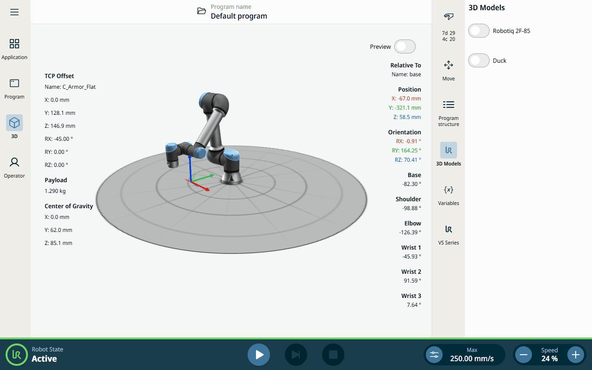
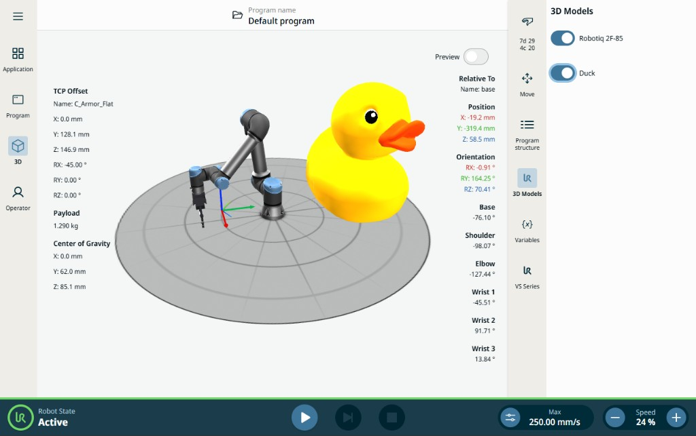

# Three Dimension Contribution X

Sidebar URCap that toggles glTF models in the PolyScope X 3D view.

| | |
| --- | --- |
| SDK | 0.20.49 |
| Tested on | URSim 10.13 |
| First release | 2026-June-2 |
| Last update | 2026-September-20 |
| Author | funh |



## Adding models to the 3D view

The **3D Models** sidebar has two toggles: **Robotiq 2F-85** and **Duck**. On turns the model on with `GLTFLoader` from `assets/gltfs/` and `presenterAPI.sceneService`. Off removes it with `deleteObjects` using the same UUID.



Get the service from the sidebar presenter:

```ts
const sceneService = this.presenterAPI()?.sceneService;
```

`addNewObject()` places the object at the world origin (near the robot base) and returns a scene-group ID, not the mesh UUID. Keep `gltf.scene.uuid` and use `addNewObjectAtPose`.

**Robotiq 2F-85** — flange frame, origin on the flange face, +Z outward. The glTF is authored Z-up; rotate −90° around X before handing it to Three.js. Then `addNewObjectAtPose` with `referenceFrame: 'flange'` and `attachToolToFlange` with **`scene.uuid`** so the gripper follows the wrist.

```ts
const poseOnFlange = controllerPose(
    zUpPositionMeters(0, 0, 0),
    zUpRotationVectorRadians(0, 0, 0),
    'flange'
);
await sceneService.addNewObjectAtPose(scene, poseOnFlange);
await sceneService.attachToolToFlange(scene.uuid, poseOnFlange);
```

`attachToolToFlange` overwrites `pose.referenceFrame` to `'flange'` and only sets pose. Pass the mesh UUID, not the group ID.

**Duck** — world `(0, 0.5, 0)` m, +90° around X (Khronos Duck is Y-up), scale 0.5. Place with `addNewObjectAtPose` and `referenceFrame: 'world'`.

```ts
await sceneService.addNewObjectAtPose(scene, {
    objectPosition: zUpPositionMeters(0, 0.5, 0),
    objectRotation: zUpRotationVectorRadians(Math.PI / 2, 0, 0),
    referenceFrame: 'world'
});
```

Turn a toggle off to remove that model:

```ts
await sceneService.deleteObjects([uuid]);
```

## Build and Deploy Sample

To build and deploy this sample, use the commands below. A rebuild of the project is required to see any changes made 
to the source code. If you are deploying the URCap to URSim, ensure that you have started the simulator.

### Dependencies

Run this command to install the dependencies of the project.

```shell
npm install
```

### Build

Run this command to build the contribution type.

```shell
npm run build
```

### Installation

Run this command to install the built URCap to the simulator.

```shell
npm run install-urcap
```

Run this command to install the built URCap to the robot.

```shell
npm run install-urcap -- --host <robot_ip_address>
````


## Further help

Get more help from the included SDK documentation.
